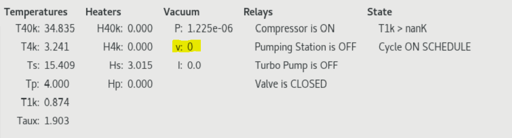

## Start the `freezecontroll` software

Navigate to `~/home/photonspot/freezecontrol2.1.7d.jpl-spot2`and open a terminal.

Run:
```shell
python freezecontrol2.1.7d_photonspot.py
```

The default python should be python 2.7. 


Depending on the state of the fridge, there's multiple things you may want to do:

## Before evacuating and cooling down. 
If you're starting the software just after closing the fridge. 

1. **Make sure the main valve bewteen the fridge and pumping station is open. **
    We are not using a computer-controlled valve, so the `OPEN Valve` button on the `Startup` tab does not do anything. 
1. **Start the pumping macro.** 
    This will take about 45 minutes to reach P < 5e-3 Torr. 
    
2. **Start one of the cooldown macros. **
    As of January 2023, the newer liquid cooled compressor is not set up to automatically start from pressing one of these buttons. (That requires one of the long black cables we have be customized for the new compressor). Instead, start the compressor manually by going into the Hutzler compressor room and flipping the green switch from 0 to 1 state. You still need to press either the `Cooldown + condense + evaporate` or `Cooldown + condense` button, so that the heat switches will response automatically and cool down the fridge to the correct temperature when it's ready. 
    

3. **Manually close the valve after about 24 hours. **
    Once the stages in the fridge reach a certain temperature (below the freezing temperature of air), the turbo pump is no longer removing any air from the cryostat. Instead if the pumping station has any tiny leaks, air will leak in and freeze on one of the stages of the cryostat. This should be avoided, so after about 24 hours of cooling the valve between the pumping station and cryostat should be closed. 


    After the valve is closed the pumping station can be turned off. Go the the `Relays` tab in the software. 

    1. First, turn off the turbo pump by checking the box and selecting `Turn OFF`. Wait for the turbo pump speed to go all the way down to zero. You can see the speed here: 
    
    2. Then turn off the pumping station using it's relay, same way as for the turbo pump. As the pumping station shuts down, you will hear it vent the vacuum inside. This is why you definitely need to have the valve between the cryostat and pumping station closed before shutting it down. 

1. Start the daily cycling

    After about 48 hours, the fridge should be in a steady evaporate or condense state depending on which macro was chosen at the start. I usually choose the `Cooldown + condense + evaporate` macro so the fridge is at base temperature as soon as possible. 

    Go to the `Cycle: On schedule` tab in the software and move the 2nd slider on the page to about 3.6. This is the slider following the phrase "Evaporate when T1k below:". 

    With extra heat load on the 1K stage, I don't see T1K ever get below 3.4 K or so at the end of the condense process. If this slider is not adjusted above 3.4 K or so, then the fridge will be continuously waiting for T1K to get lower and will never start the evaporate macro. 

    Finally, set the `Condense start` and `Evaporate start` times to your preference and hit the `Activate` button to start the on-schedule cycling. 

    If something gets messed up about the on-schedule cycling (maybe you got the times wrong, or the evaporate temperature slider needs to be higher), just close the whole software and start over. The software as-is isn't very clear about when a certain macro is activated, and it can do weird things if you activate multiple macros over each other. 


## If the fridge is already cryo-pumping
This could be the case after something with the computer got messed up, like there was a momentary power outage. 

The 1K stage could be in 3 possible states:

* The T1K stage is at about 4 Kelvin, the pot has likely run out of helium. The fridge needs to go through the condense and the evaporate steps. 
* The T1K stage is at about 3.3 Kelvin or near there. The fridge is likely already condensed and just needs to evaporate
* The T1K stage is already at base temperature, about 0.9 K. This could be the case if you're just restarting the software. Skip ahead to **Activate On Schedule Cycling**.

In the first two cases, take the following steps to get the fridge to base temperature immediately. Then you can set up the on schedule cycling:

=== "Condense and Evaporate"
    On the `On Demand` tab, make sure the slider following "Evaporate when T1K below:" is set to about 3.6 K. Then select the `Condense + Hold + Evaporate` button at the top. 

=== "Evaporate Only"
    On the `On Demand` tab, make sure the slider following "Evaporate when T1K below:" is set to about 3.6 K. Then select the `Evaporate` button just above the slider. 

#### Activate On Schedule Cycling

Once the fridge is at base temperature (this can take up to 3 hours for `condense + evaporate` or about 30 minutes for `evaporate`), you can set up the auto cycling. 

After about 48 hours, the fridge should be in a steady evaporate or condense state depending on which macro was chosen at the start. I usually choose the `Cooldown + condense + evaporate` macro so the fridge is at base temperature as soon as possible. 

Go to the `Cycle: On schedule` tab in the software and move the 2nd slider on the page to about 3.6. This is the slider following the phrase "Evaporate when T1k below:". 

With extra heat load on the 1K stage, I don't see T1K ever get below 3.4 K or so at the end of the condense process. If this slider is not adjusted above 3.4 K or so, then the fridge will be continuously waiting for T1K to get lower and will never start the evaporate macro. 

Finally, set the `Condense start` and `Evaporate start` times to your preference and hit the `Activate` button to start the on-schedule cycling. 

If something gets messed up about the on-schedule cycling (maybe you got the times wrong, or the evaporate temperature slider needs to be higher), just close the whole software and start over. The software as-is isn't very clear about when a certain macro is activated, and it can do weird things if you activate multiple macros over each other. 

Finally to re-iterate, if you need to change some parameters of the currently running on-schedule cycling, just close the program and follow these steps again. This way we avoid getting in the program into some weird unreliable state. 


